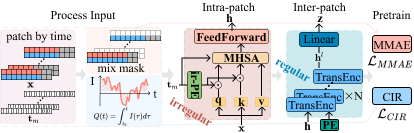

# LiPM: Foundation Model for Lithium-Ion Battery Analysis

[Juren Li](mailto:jrlee@zju.edu.cn)$^1$,
[Yang Yang](mailto:yangya@zju.edu.cn)$^{1*}$,
[Hanchen Su](mailto:hcsu@zju.edu.cn})$^{1}$,
[Jiayu Liu](mailto:ljymail@zju.edu.cn)$^{1}$,
[Youmin Chen](mailto:youminchen@zju.edu.cn)$^1$,
[Jianfeng Zhang](mailto:zhangjianfeng3@huawei.com)$^2$,
[Lujia Pan](mailto:panlujia@huawei.com)$^2$. 
( $^*$ Correspondence )

$^1$ College of Computer Science and Technology, Zhejiang University

$^2$ Huawei Noah’s Ark Lab

---
[](https://doi.org/10.1145/3711896.3737027)

This repository contains the code for the LiPM model introduced in our paper titled "LiPM: Foundation Model for Lithium-Ion Battery Analysis" accepted by [**KDD' 25**](https://kdd2025.kdd.org/) (18.4\% acceptance rate).

## LiPM



We propose **LiPM**, a pretrained foundation model that unifies multi-dataset learning through physics-aware objectives and irregularity-tolerant temporal modeling. 
LiPM introduces three key innovations: 
(1) A Mix-Masked Autoencoder (MMAE) enforcing electrochemical consistency via joint reconstruction of temporally masked patches and cross-channel masked variables, 
(2) A Coulombic Integration Regression (CIR) task explicitly encoding charge conservation laws, and (3) A dual-scale temporal encoder combining irregular intra-patch processing (preserving raw timestamps) with regular inter-patch attention (capturing macroscopic dynamics). 
Trained on eight heterogeneous battery datasets without cycle-label annotations, LiPM demonstrates universal applicability across partial charge-discharge segments and irregular sampling protocols. 


## Current Contents 
- **Model**: The implementation of the LiPM model.
  - `battery_model.py`: Main implementation file for the LiPM model.
  - `iTransformer.py`: Implements intra-patch and inter-patch modules used in the LiPM model.
- **Pre-training**: 
  - `trainer.py`: Training code for single GPU or CPU environments.
  - `trainer_DDP.py`: Training code for multi-GPU using PyTorch's `DistributedDataParallel` strategy.
- **Data processing**:
  - `dataset/.`: Contains the data processing code.
  - For each dataset, we implement code for pretraining/downstream tasks, and handle irregular time series (non-uniform sampling) and regular time series (uniform sampling).
- **Documentation**: Usage instructions and necessary details to understand the model architecture.

## Requirements
The recommended requirements for LiPM are specified as follow:
- Python 3.8+
- torch 1.13+
- numpy 1.24.3
- joblib 1.3.1

The dependencies can be installed by:

 ```bash
pip install -r requirements.txt
 ```

 ## File Structure
 ```
 .
├── assets
│   ├── framework.png
│   └── patching.png
├── battery_model.py
├── dataset
│   ├── basic_dataset.py
│   ├── battery_dataset.py
│   ├── CALCE_dataset.py
│   ├── data_utils.py
│   ├── HNEI.py
│   ├── HUST_dataset.py
│   ├── __init__.py
│   ├── MATR_dataset.py
│   ├── NASA_dataset.py
│   ├── RWTH_dataset.py
│   ├── SNLLFP_dataset.py
│   └── ULPurdue_dataset.py
├── default_config.py
├── iTransformer.py
├── README.md
├── requiremen.txt
├── trainer_DDP.py
├── trainer.py
└── utils.py
 ```

## Dataset
The LiPM model is trained on eight heterogeneous battery datasets:
RWTH, NASA, CALCE, HUST, SNL_LFP, HNEI, UL-Purdue and MATR.

The preprocess code of each dataset can be found in [Battery-Data](https://github.com/JuRenGithub/Battery-Data).

## Contact
If you have any question about the code or the paper, feel free to contact me through [email](mailto:jrlee@zju.edu.cn).

## Future Updates
**More Upcoming Features and Improvements will be available in the latest [LiPM](https://github.com/JuRenGithub/LiPM) repository.**